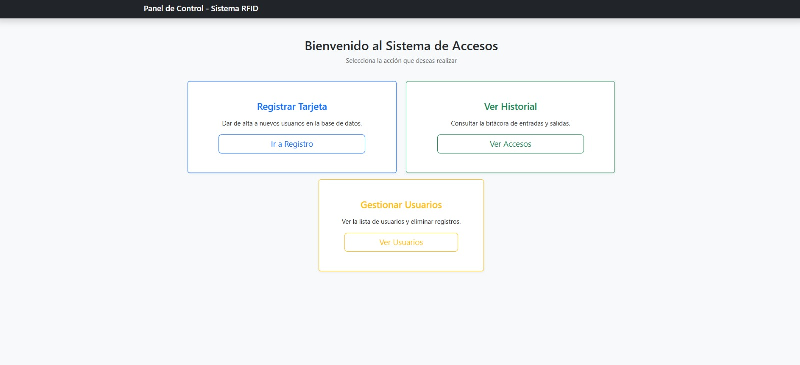
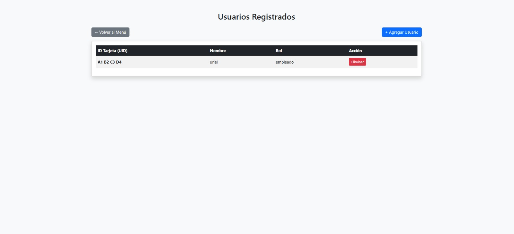
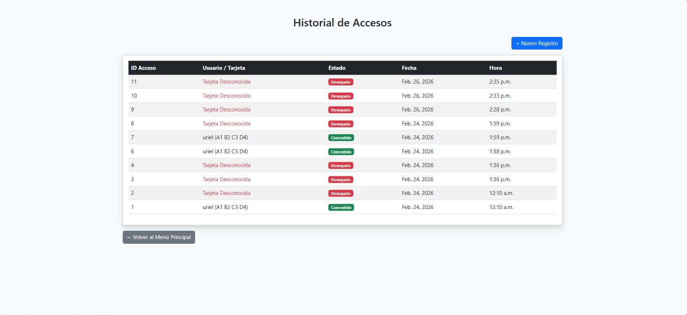

# 🚀 RFID Access System

<div align="center">


[](https://github.com/ElUlisantos/SistemaAccesos/stargazers)

[](https://github.com/ElUlisantos/SistemaAccesos/network)

[](https://github.com/ElUlisantos/SistemaAccesos/issues)


**A comprehensive web-based RFID Access Control System powered by Django and ESP32.**


</div>

## 📖 Overview
This project was developed during the Wireless Networks class taught at the Benemérita Universidad Autónoma de Puebla. The main purpose was to create an access control system using wireless technologies (RFID and Wi-Fi).

The project includes a web application in Django + SQlite to manage and monitor users, as well as an ESP32 circuit to read RFID cards and interact with an access point (servo).

## ✨ Features

-   **RFID Tag Management**: Register, update, and deactivate RFID tags associated with users.
-   **User  Management**: Create and manage users, assign roles, and define various access points.
-   **Real-time Access Logging**: Record all access attempts (granted or denied) with timestamps and user information.
-   **Web-based Administration Interface**: A user-friendly Django Admin panel for full control over the system.
-   **Hardware Integration**: Seamless communication with ESP32 RFID readers to process physical access requests.
-   **Scalable Architecture**: Built on Django, allowing for easy expansion and integration with other systems.

## 🖥️ Screenshots

TODO: Add actual screenshots of the Django Admin interface and potentially the hardware setup.







You can find a demostration video here
(in spanish)
## 🛠️ Tech Stack

**Backend:**


**Database:**


**Embedded System (Hardware):**


## 🚀 Quick Start

Follow these steps to get this project up and running locally.

### Prerequisites
Before you begin, ensure you have met the following requirements:

-   **Python 3.8+**: Essential for running the Django application.
-   **pip**: Python package installer (usually comes with Python).
-   **Arduino IDE**: For compiling and uploading the `sketch.ino` to your Arduino board.
-   **ESP32**: e.g., ESP32,ESP32 S3, or similar.
-   **RFID Reader Module**:  MFRC522.
-   **Servo Motor **:  SG90 or similar
-   **Internet Connection**: To download Python packages.

### Installation

1.  **Clone the repository**
    ```bash
    git clone https://github.com/ElUlisantos/SistemaAccesos.git
    cd SistemaAccesos
    ```

2.  **Create a Python Virtual Environment** (recommended)
    ```bash
    python -m venv venv
    source venv/bin/activate  # On Windows, use `venv\Scripts\activate`
    ```

3.  **Install Python dependencies**
    Use this command
    ```bash
    pip install -r requirements.txt
    ```
4.  **Database setup**
    Apply database migrations and create a superuser for accessing the Django admin panel.
    ```bash
    python manage.py makemigrations
    python manage.py migrate
    python manage.py createsuperuser
    ```

5.  **Arduino Setup**
    *   Open `sketch.ino` in the Arduino IDE.
    *   Install necessary libraries (MFRC522, ESP32Servo, ArduinoJson).
    *   Configure network credentials (SSID, password)  and the Django API endpoint.
    *   Connect your Arduino board and RFID module.
    *   Compile and upload the sketch to your ESP32 board.

6.  **Start development server**
Create a new firewall rule to the 8000 port in your computer and then run the following command inside the repositiry folder you choose
    ```bash
    python manage.py runserver 0.0.0.0:8000
    ```

8.  **Open your browser**
    Visit `http://127.0.0.0:8000` to access the Django application. You can log in to the admin panel at `http://localhost:8000/admin` using the superuser credentials you created.

## 📁 Project Structure

```
SistemaAccesos/
├── .gitattributes
├── .gitignore
├── manage.py              # Django's command-line utility
├── SistemaAccesos/        # Main Django project directory
│   ├── __init__.py
│   ├── settings.py        # Project settings
│   ├── urls.py            # Project URL configurations
│   ├── wsgi.py            # WSGI configuration for deployment
│   └── asgi.py            # ASGI configuration (for async, if used)
├── control_rfid/          # Django app for RFID logic
│   ├── migrations/        # Database migration files
│   ├── __init__.py
│   ├── admin.py           # Admin interface configuration
│   ├── apps.py            # App configuration
│   ├── models.py          # Database models (e.g., RFID tags, access logs)
│   ├── views.py           # Views for handling requests
│   └── urls.py            # App-specific URL configurations
├── sketch.ino             # Arduino sketch for RFID reader hardware
└── README.md
```

## ⚙️ Configuration

### Environment Variables
Will be added soon:)

### Django Settings
The main configuration for the Django application is located in `SistemaAccesos/settings.py`.

### Arduino Sketch Configuration
The `sketch.ino` file will contain configuration specific to the hardware, such as:
-   RFID reader pin configurations.
-   Wi-Fi credentials (SSID, password).
-   The base URL or IP address of the Django application's API endpoint. Change the IP for the one of your computer
```bash
const  char* serverName = "http://192.68.0.105:8000/api/verificar/";
```
## 🔧 Development

### Available Scripts (Django)
Standard Django management commands are available via `manage.py`:

| Command                       | Description                                                     |

|-------------------------------|-----------------------------------------------------------------|

| `python manage.py runserver`  | Starts the development web server.                              |

| `python manage.py migrate`    | Applies database migrations.                                    |

| `python manage.py makemigrations [app_name]` | Creates new database migrations based on model changes.         |

| `python manage.py createsuperuser` | Creates an administrative user for the Django admin panel.      |

| `python manage.py shell`      | Opens a Python shell with Django environment loaded.            |

| `python manage.py collectstatic` | Collects static files into a single directory for deployment. |

### Development Workflow
1.  Ensure prerequisites are met and virtual environment is active.
2.  Run `python manage.py runserver`.
3.  Access the Django admin at `http://localhost:8000/admin` to manage data.
4.  Develop/test the Arduino component by uploading `sketch.ino` and monitoring serial output.
5.  Ensure the Arduino is configured to communicate with the local Django server (e.g., `http://192.168.1.X:8000/api/access/` if using local network).

## 🧪 Testing

(TODO: If a testing framework like `pytest-django` or Django's built-in `unittest` is used, add specific instructions here.)

Currently, there are no explicit test files detected. For Django, you can run tests using:
```bash

# Run all tests
python manage.py test

# Run tests for a specific app
python manage.py test control_rfid
```
For the Arduino sketch, testing typically involves observing serial monitor output and physical interaction with the RFID reader.


## 📚 API Reference (Internal)

The Django application exposes internal endpoints primarily for its web interface and potentially for the Arduino device to communicate access events.

### Authentication
The Django admin interface uses session-based authentication, but no extra security was implemented, use JWT or similar technologies in production.

### Key Endpoints (Examples, based on typical RFID access control)

-   `POST /api/access/`: Endpoint for Arduino to send RFID scan data (tag ID, access point ID, timestamp).
-   `GET /admin/`: Django Admin interface for managing users, RFID tags, access points, and reviewing logs.

## 📄 License

Feel free to use this repository as you wish, but we would appreciate it if you cite this repository if you use it in an academic or corporate setting.


---

<div align="center">

**⭐ Star this repo if you find it helpful!**

Made  by 
- [ElUlisantos](https://github.com/ElUlisantos)
- [manuelogasxx](https://github.com/ElUlisantos)
- - [manuelogasxx](https://github.com/BrianEsio)

</div>
